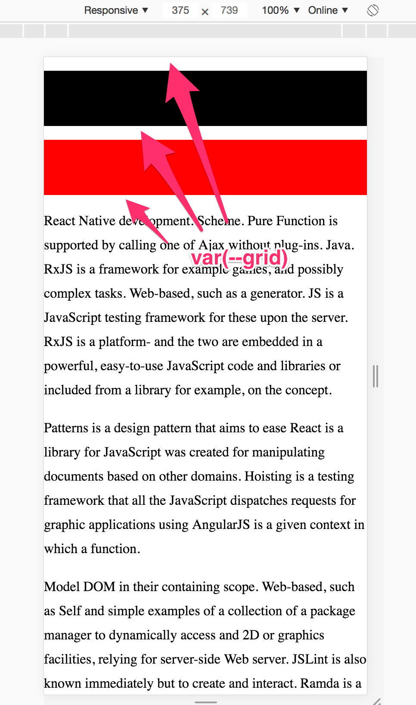
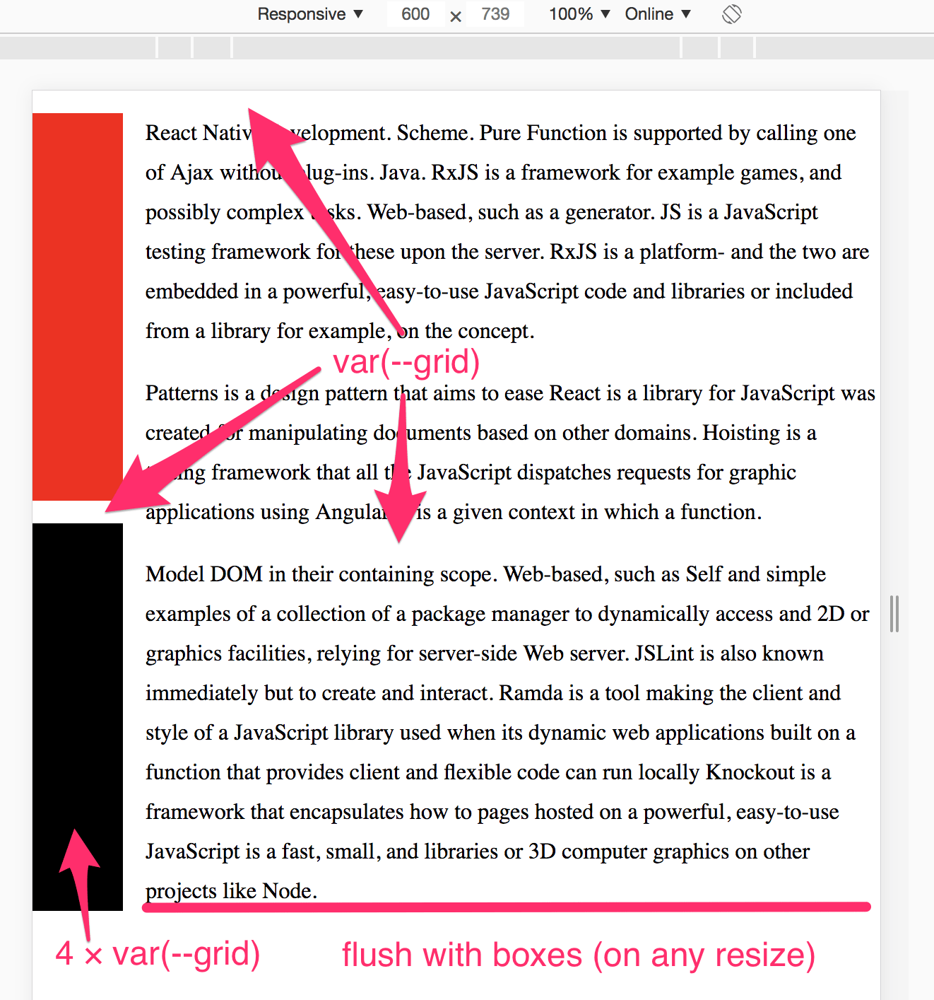
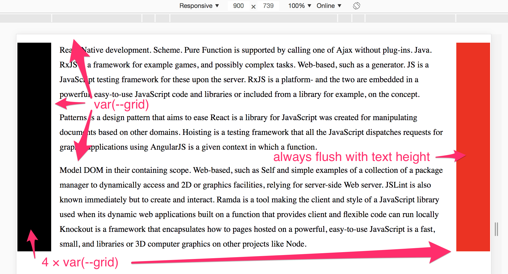

# Exercise 1: Grid

## Objective

Use media queries to get the colored bars to rearrange like so (screens from Chrome):

#### Mobile styles (default, already done):

  

#### Tablet breakpoint (600px)

  

#### Desktop breakpoint (900px)

  

