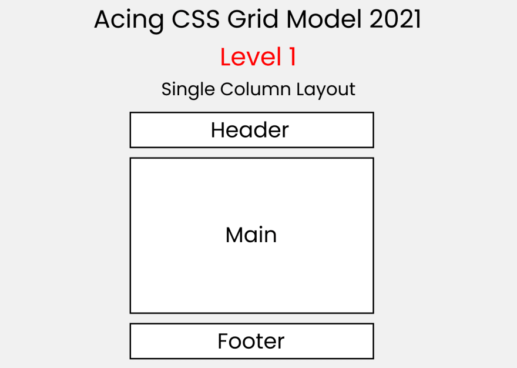

# Exercise 5: Pattern

## Objective

Create the following layouts using CSS Grid. You may use Flexbox too if required.

### Layout 1

  

### Layout 2

  

### Layout 3

  

### Layout 4

  

### Layout 5

  

